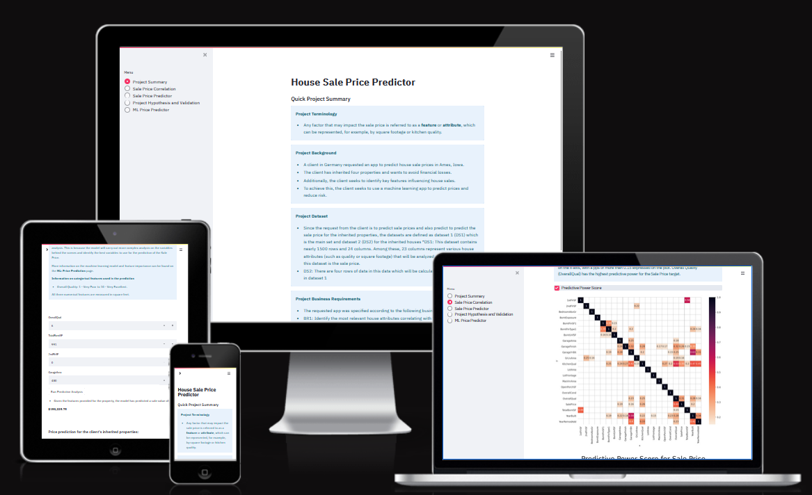
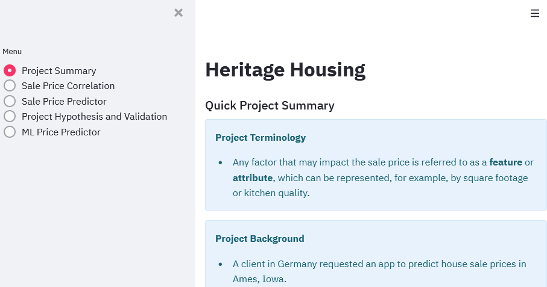

# HOUSE SALE PRICE PREDICTOR

This website is designed to predict house sale prices by training a machine learning model using existing data on house attributes and their corresponding sale prices.

## Dataset Content

* The dataset is sourced from [Kaggle](https://www.kaggle.com/codeinstitute/housing-prices-data). We then created a fictitious user story where predictive analytics can be applied in a real project in the workplace.
* The dataset has almost 1.5 thousand rows and represents housing records from Ames, Iowa, indicating house profile (Floor Area, Basement, Garage, Kitchen, Lot, Porch, Wood Deck, Year Built) and its respective sale price for houses built between 1872 and 2010.

|Variable|Meaning|Units|
|:----|:----|:----|
|1stFlrSF|First Floor square feet|334 - 4692|
|2ndFlrSF|Second-floor square feet|0 - 2065|
|BedroomAbvGr|Bedrooms above grade (does NOT include basement bedrooms)|0 - 8|
|BsmtExposure|Refers to walkout or garden level walls|Gd: Good Exposure; Av: Average Exposure; Mn: Minimum Exposure; No: No Exposure; None: No Basement|
|BsmtFinType1|Rating of basement finished area|GLQ: Good Living Quarters; ALQ: Average Living Quarters; BLQ: Below Average Living Quarters; Rec: Average Rec Room; LwQ: Low Quality; Unf: Unfinshed; None: No Basement|
|BsmtFinSF1|Type 1 finished square feet|0 - 5644|
|BsmtUnfSF|Unfinished square feet of basement area|0 - 2336|
|TotalBsmtSF|Total square feet of basement area|0 - 6110|
|GarageArea|Size of garage in square feet|0 - 1418|
|GarageFinish|Interior finish of the garage|Fin: Finished; RFn: Rough Finished; Unf: Unfinished; None: No Garage|
|GarageYrBlt|Year garage was built|1900 - 2010|
|GrLivArea|Above grade (ground) living area square feet|334 - 5642|
|KitchenQual|Kitchen quality|Ex: Excellent; Gd: Good; TA: Typical/Average; Fa: Fair; Po: Poor|
|LotArea| Lot size in square feet|1300 - 215245|
|LotFrontage| Linear feet of street connected to property|21 - 313|
|MasVnrArea|Masonry veneer area in square feet|0 - 1600|
|EnclosedPorch|Enclosed porch area in square feet|0 - 286|
|OpenPorchSF|Open porch area in square feet|0 - 547|
|OverallCond|Rates the overall condition of the house|10: Very Excellent; 9: Excellent; 8: Very Good; 7: Good; 6: Above Average; 5: Average; 4: Below Average; 3: Fair; 2: Poor; 1: Very Poor|
|OverallQual|Rates the overall material and finish of the house|10: Very Excellent; 9: Excellent; 8: Very Good; 7: Good; 6: Above Average; 5: Average; 4: Below Average; 3: Fair; 2: Poor; 1: Very Poor|
|WoodDeckSF|Wood deck area in square feet|0 - 736|
|YearBuilt|Original construction date|1872 - 2010|
|YearRemodAdd|Remodel date (same as construction date if no remodelling or additions)|1950 - 2010|
|SalePrice|Sale Price|34900 - 755000|

## Business Requirements

In the following sections the business requirements will be explained, firstly a section describing the background followed by a problem statement, finally a description of the business case.

### Background

Our client, going by the alias 'Lydia Doe', has received an inheritance from a deceased great-grandfather. Included in the inheritance are four houses located in Ames, Iowa, USA. Lydia seeks assistance in maximizing the sales price for these inherited properties. To achieve this goal, she has chosen to enlist the help of a Data Practitioner. Her reasons for doing so include:

- Lydia lacks knowledge about the value of the properties and wishes to avoid the risk of inaccurate pricing estimation. Given the potential for significant financial gains or losses when selling the four properties, she seeks assistance to ensure optimal pricing strategies.
- Additionally, Lydia is keen on predicting the sale price of any house in Ames, Iowa, for potential future property ownership in the area 

From searching the Internet, Lydia found a public dataset with house prices for Ames, Iowa, and will provide us with that. We will build a Data Web App to predict the sales price from the four houses based on the house attributes. 

### Work methodology

To achieve our goal, we will use the Cross-Industry Standard Process for Data Mining (CRISP-DM) workflow. This workflow is documented and reflected in the logical order in which the files were created, aligning with the stages of the CRISP-DM process. While the framework guides us to create files and work in a specific sequence, we also incorporate agile principles. This allows us to iterate and refine our solution, ensuring we deliver an optimal final product that meets the client's requirements.

The following steps defines the CRISP-DM workflow, after each a point, a corresponding file or readme section is defined to explain the overall connection (best fit) between the stages and files and methods described in this project.

Business Understanding: Readme -  Background and Problem definition chapters.
Data Understanding:     01 - DataCollection.ipynb
Data Preparation:       02 - DataCleaning.ipynb, 03 - CorrelationStudy.ipynb
Modeling:               04 - FeatureEngineering.ipynb
Evaluation:             05 - ModelEvaluteRegr_PredictPrice.ipynb
Deployment:             Streamlit App, deployed on Heroku (locally run with app.py) 

### Problem definition

While the client is well-versed in the determinants of property worth in her own area, it's crucial to understand the unique drivers of value in Ames, Iowa. The client worries that her personal expertise may not be adequate to accurately assess the value, potentially resulting in erroneous appraisals and financial losses.

### Requirements

* 1. - The client is interested in identifying which house attributes have the strongest correlation with the sale price. 

* 2. - The client expects data visualisations of the correlated variables against the sale price to show that.

* 3. - The client is interested in predicting the house sale price from her four inherited houses and any other house in Ames, Iowa.

### User stories

- User Story 1: As a user, I want to view the attributes correlated to the sale price, so that I can identify the key features for upcoming sales.
- User Story 2: As a user, I want to be able to determine the likely sale price of a home based on certain features, so that I can gain insight into the likely values of a given home in the area.
- User Story 3: As a user, I want to be able to view the four main key features with a threshold score of 0.8, so that I can easily see the features that are most relevant from a predictive power score perspective.

## Hypothesis, validation and result

1. Hypothesis: Sales price house attribute correlation:
   We assume that associoated variables for the following four features has the strongest correlation: lot area, property size, condition and age of the property:
    - Validation: Evaluate the available house attributes in a correlation study, mention the the values above 0,6 for either Spearman or Pearson correlation.
    - Result: From the calculations we can see that some of our assesement of features were correct, below is the details explained:     
    * OverallQual - Correct, associated to condition.
    * GrLivArea - Correct, associated to size.
    * GarageArea - Correct, associated to size.   
    * TotalBsmtSF - Correct, associated to size.  
    * YearBuilt -  Correct, associated to age.
    * 1stFlrSF - Correct, associated to size.

    * Note: **lot area** is not part of property size so in this case the assumption was incorrect.  

2. Hypothesis: Determine sales price:
   We assume that the following variables will be sufficient to confidently predict the price: lot area, house size (1stFlrSF ), overall quality and the build year.
   - Validation: Use a machine learning model and optimization procedures to ensure the application of appropriate methods.
   - Result: We noticed also in this case a partial match to the assumption.
    * OverallQual - Correct
    * TotalBsmtSF - Incorrect, this area variable were not part of the assumption.
    * 2ndFlrSF - Incorrect, this area variable were not part of the assumption.
    * GarageArea - Correct

3.  Hypothesis: Sales price evolution:
   We assume that the four features found in Hypothesis 2 is sufficient to reach a 0.8 could be used as predictive power indicator:
   - Validation: Review the result from the trained models in Hypothesis 2 and display it in the streamlit app.
   - Result: Correct, the four features were able to use as confidently predict house sale prices, the R² score of 0.886 on the training set and 0.84 on the test set suggests that the model explains a large portion of the variance in the sale prices, which is a good sign. It means that these four features are indeed very important and provide significant predictive power.

## The rationale to map the business requirements to the Data Visualisations and ML tasks

 Business Requirement 1: Correlation Study
- Task 1: Inspect the data provided by the client to ensure it is clean and ready for analysis.
- Task 2: Conduct correlation studies to identify which variables have the strongest impact on house sale prices.
- Task 3: Plot significant variables against sale prices to visualize their relationships.

Business Requirement 2: Data Visualization
- Task 1: Apply data handling techniques to prepare various data types for visualization.
- Task 2: Identify and use the most suitable trendlines or plots based on the distribution and characteristics of the data.
- Task 3: Create clear and informative visualizations to highlight the correlations between house attributes and sale prices.

Business Requirement 3: Predictive Modeling
- Task 1: Implement a predictive model to estimate house sale prices.
- Task 2: Handle missing data effectively to ensure accurate predictions for all variables.
- Task 3: Provide the client with a tool or method to predict the sale prices of her four inherited houses and any other house in Ames, Iowa.

## ML Business Case

### Predict Sales price
We want an ML model to predict sale price, in dollars, for a home in Ames, Iowa. The target variable is a continuous number. We firstly consider a regression model, which is supervised and uni-dimensional.
Our ideal outcome is to provide a client with the ability to reliably predict the sale price of any home in Ames, Iowa, and more specifically the inherited properties the client is particularly concerned with.
The model success metrics are:
At least 0.8 for R2 score, on train and test set.
The model is considered a failure if: after 12 months of usage, the model predictions are 50% off more than 30% of the time, and/or the R2 score is less than 0.8.
The output is defined as a continuous value of sale price in dollars. Private parties/home owners/clients can access the app online and input data for their homes. The app can also be useful for real estate agents who want to give a quick estimate of saleprice to a prospective client, they can input the data on the fly while in live communication with a prospective client.
The training data come from a public data set, which contains approx. 1500 property sales records. It contains one target features: sale price, and all other variables (23 of them) are considered features.

#### Regression Model
   * We want an ML model to predict sales price, in months, for a prospect expected to churn. A target variable is a discrete number. We consider a regression model, which is supervised and uni-dimensional.
   * Our ideal outcome is to provide our sales team with reliable insight into onboarding customers with a higher sense of loyalty.
   * The model success metrics are
   * At least 0.8 for R2 score, on train and test set
   * The ML model is considered a failure if:
      * after 12 months of usage, the model's predictions are 50% off more than 30% of the time. Say, a prediction is >50% off if predicted 10 months and the actual value was 2 months.
   * The output is defined as a continuous value for tenure in months. It is assumed that this model will predict tenure if the Predict Churn Classifier predicts 1 (yes for churn). If the prospect is online, the prospect will have already provided the input data via a form. If the prospect talks to a salesperson, the salesperson will interview to gather the input data and feed it into the App. The prediction is made on the fly (not in batches).

The predictive model should aim to acchieve an R2 value of 0.8 or higher

No wireframes, no kanban board. Get data 

## Dashboard Design

### Page 1: Quick project summary
- Project Terminology
   - Description of factors that may impact the sale (features and attributes).
- Project Background
   - A short background about the motivation and request to initiate the project.
- Project Business Requirements
   - This section outlines the business requirements derived from the project background.

Project Summary Page

### Page 2: Sale Price Correlation
- This page displays the result connected to **Business Requirement 1** and 
**Business Requirement 2**
   -  Information of the business requirement criteria
   -  Explanation of the correlation study (Spearman and Pearson) and correlation score threshold.
   -   Information for histogram and scatterplots for the most relevant 
   house attributes.
   - Information and threshold values selected for power predictive score heatmap and bar plot visualization.

- Checkboxes:
   -  CB: "Inspect Sale Price Dataset": Present 10 rows of the dataset.
   -  CB: "Pearson Correlation": Present Pearson heatmap and barplot.
   -  CB: "Spearman Correlation": Present Pearson heatmap and barplot.
   -  CB: "Correlation Plots of Variables vs Sale Price": Present correlation, single variable to sale price.

### Page 3: Sale Price Predictor
- This page displays the result connected to **Business Requirement 3**
   -  Information on the business requirement criteria.
   -  Explanation of which features were selected to use as predictors.
   -  Information regarding details of the features.
   -  Presentation field for predicting house price and inherited houses.

- Input fields predict house price
   - IF: "OverallQual"  : Set a value between 1 to 10.
   - IF: "TotalBsmtSF"  : Set a value, max 15275.
   - IF: "2ndFlrSF"     : Set a value, max 5162.
   - IF: "GarageArea"   : Set a value, max 3545.

- Buttons
   - BN: "Run Predictive Analysis": Perform calculation and present it
   - BN: "Run Prediction on Inherited Homes"

### Page 4: Project Hypothesis and Validation
- Introduction to hypothesis feature selection criteria.
- Hypothesis 1,2 and 3 presented and their result.
- Link to the readme file.

### Page 5: ML Price Predictor
- This page displays the result connected to 
- Introduction to hypothesis feature selection criteria.
- Hypothesis 1,2 and 3 presented and their result.

## Unfixed Bugs

* No known bugs.

## Deployment

### Heroku

* The App live link is: <https://YOUR_APP_NAME.herokuapp.com/>
* Set the runtime.txt Python version to a [Heroku-20](https://devcenter.heroku.com/articles/python-support#supported-runtimes) stack currently supported version.
* The project was deployed to Heroku using the following steps.

1. Log in to Heroku and create an App
2. At the Deploy tab, select GitHub as the deployment method.
3. Select your repository name and click Search. Once it is found, click Connect.
4. Select the branch you want to deploy, then click Deploy Branch.
5. The deployment process should happen smoothly if all deployment files are fully functional. Click the button Open App on the top of the page to access your App.
6. If the slug size is too large then add large files not required for the app to the .slugignore file.

## Main Data Analysis and Machine Learning Libraries

* Here you should list the libraries you used in the project and provide example(s) of how you used these libraries.

## Credits

* In this section, you need to reference where you got your content, media and extra help from. It is common practice to use code from other repositories and tutorials, however, it is important to be very specific about these sources to avoid plagiarism.
* You can break the credits section up into Content and Media, depending on what you have included in your project.

### Content

* The text for the Home page was taken from Wikipedia Article A
* Instructions on how to implement form validation on the Sign-Up page was taken from [Specific YouTube Tutorial](https://www.youtube.com/)
* The icons in the footer were taken from [Font Awesome](https://fontawesome.com/)

### Media

* The photos used on the home and sign-up page are from This Open Source site
* The images used for the gallery page were taken from this other open-source site

## Acknowledgements (optional)

* Thanks to my mentor Mo Shami for his support and advice.